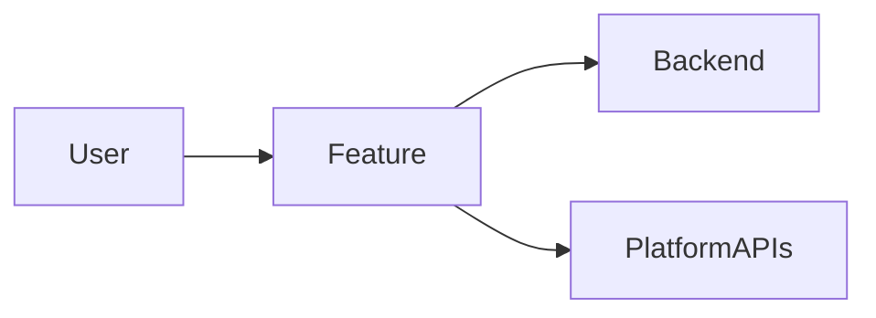
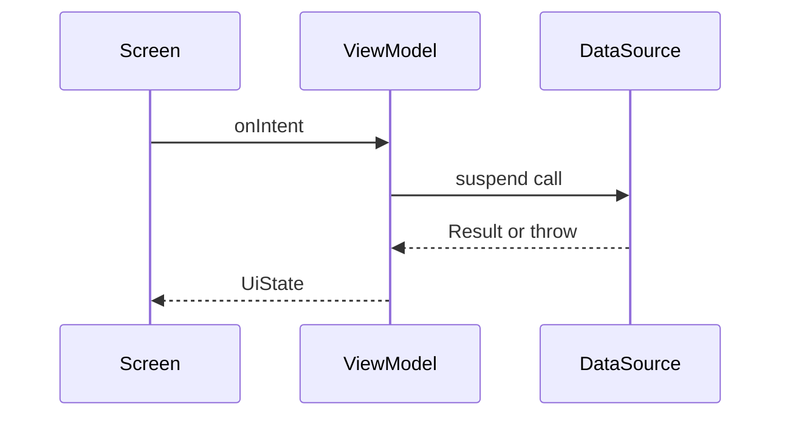

# HLD — <Feature / Module name>

**Scope of this doc:** system-level HOW for a `:shared` KMP feature — architecture, module interaction, platform abstraction. Not class-level detail. Crosscutting rules are **cited** from `.claude/documents/*`, never restated. Conventions & `[TBD]` rule: see [conventions](conventions.md).

## 1. Context & Scope
[TBD]

## 2. Goals & Non-Goals
- **Goals:** [TBD]
- **Non-Goals:** [TBD]

## 3. The Design
### 3.1 System context diagram
> Diagram **required** (Mermaid): the feature, its users, and external systems (backend, platform APIs).

### 3.2 Components & responsibilities
> Map each to its `feature-template.md` layer (presentation / data; domain only per collapse rules).

| Component | Layer | Responsibility |
|-----------|-------|----------------|
|           |       |                |

### 3.3 Data & domain model (high level)
> Key entities; local persistence choice (StoreManager for secrets; SQLDelight is PROPOSED per `library-guide.md`); cache/sync. No field-level schema (→ LLD/TRD).
[TBD]

### 3.4 Interfaces (high level)
> Backend APIs consumed · platform APIs used · the module's public surface. No full contracts (→ TRD/LLD).
[TBD]

### 3.5 Key flows (interaction + data flow)
> Diagram **required** (Mermaid sequence): component-level flow.

[TBD]

### 3.6 Tech & library choices
> Cite `library-guide.md` for every choice. Any new dependency needs the library checklist + explicit approval (pinned versions, commonMain blocklist).

| Choice | Why | Source |
|--------|-----|--------|
|        |     | library-guide.md |

### 3.7 Platform abstraction & parity
> Shared-vs-platform split via `expect/actual` or an injected interface; `commonMain` purity (no `android.*` / non-JetBrains `androidx.*`; per `library-guide.md`). Where Android/iOS diverge.
[TBD]

### 3.8 Permissions model
> Per `platform-rules.md` / `android-platform` behaviour — which permissions, when requested, denied / permanently-denied / background handling; POST_NOTIFICATIONS (API 33+).
[TBD]

### 3.9 Offline, sync & lifecycle
> Offline behaviour, retry/queue; background work via WorkManager (per `platform-rules.md`); `CmpHostActivity` + Navigation 3 hosting (**TARGET — not yet built; per-screen `ComponentActivity` today**); process-death / config-change handling.
[TBD]

## 4. Alternatives Considered
| Option | Pros | Cons | Verdict |
|--------|------|------|---------|
|        |      |      |         |

## 5. Cross-Cutting Concerns (reference the recorded doc — do not restate)
| Concern | Approach | Cite |
|---------|----------|------|
| Architecture / MVI | | core-facts.md · feature-template.md |
| Errors | AppErrorType (enum + wireValue) | core-facts.md |
| Concurrency | viewModelScope · injected AppDispatchers | core-facts.md |
| One-shot effects | D2 (Channel vs nullable UiState field) | core-facts.md |
| UI / Design System | SnabbitScreen + DS components + tokens | component-catalog.md |
| Security / storage | StoreManager (DataStore + Tink) | platform-rules.md |
| Observability | crash / ANR / analytics | [TBD] |

## 6. Per-Platform Considerations
| Platform | Key considerations |
|----------|--------------------|
| Android | min-SDK, `CmpHostActivity` + Navigation 3 (**TARGET, not yet built**), background limits, permissions, OEM variance |
| iOS | min-iOS, ComposeUIViewController host, background modes, App Review; **iOS engine currently limited — confirm before network paths** |

## 7. Distribution & Compatibility
> Min-OS / device matrix · pinned stack (`library-guide.md`) · iOS compile gate (`:shared:compileTestKotlinIosArm64`).
[TBD]

## 8. Rollout Strategy
> Remote Config flag / staged rollout / rollback approach.
[TBD]

## 9. Risks & Mitigations
| Risk | Likelihood | Impact | Mitigation |
|------|-----------|--------|------------|
|      |           |        |            |

## 10. Open Questions
| # | Question | Owner | Needed by |
|---|----------|-------|-----------|
| 1 |          |       |           |
