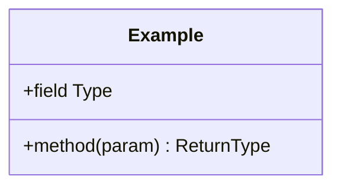
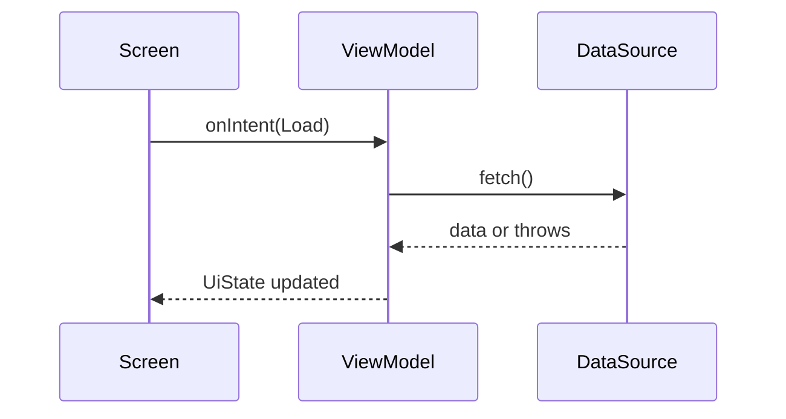

# LLD — <Module / Component name>

**Scope of this doc:** detailed HOW for ONE HLD component in `:shared` — MVI file layout, classes, data, Android/iOS mapping. No system redesign. Crosscutting rules are **cited** from `.claude/documents/*`, never restated. Conventions & `[TBD]` rule: see [conventions](conventions.md).

> **Feature-first layout + build-feature GATE 4 order** (`cmp-architecture-structure.md`): `ui/contracts/<Feature>Contract.kt` (Intent+UiState+SideEffect) → `data/DataSource` → i18n fallback → `ui/viewmodel/ViewModel` → `ui/screens/Screen` → Fake → Test.

## 1. Introduction
- Component purpose: [TBD]
- Implements HLD component: [TBD]
- Objectives (from HLD/TRD): [TBD]

## 2. Design Overview
> Feature-first layout (`cmp-architecture-structure.md`): `ui/{contracts,viewmodel,screens,components}` + `data/` + `di/`; `domain/` only per collapse. Contract = `ui/contracts/<Feature>Contract.kt` (Intent+UiState+SideEffect). `commonMain` pure (verify iOS). ViewModel = `androidx.lifecycle.ViewModel`, `viewModelScope` only.
[TBD]

## 3. Public API / Contract
| Member | Params | Returns | Pre-conditions | Post-conditions |
|--------|--------|---------|----------------|-----------------|
|        |        |         |                |                 |

## 4. Internal Interfaces & Data
### 4.1 Collaborator contracts (seams — `suspend`, main-safe)
| Component | Method | Params | Returns |
|-----------|--------|--------|---------|
|           |        |        |         |

### 4.2 Local data store / schema
> Secrets/tokens → `StoreManager` (DataStore + Tink, per `platform-rules.md`). SQL is PROPOSED (`library-guide.md`). Field-level schema if persisted; else N/A.
[TBD]

## 5. Data Structures
> `UiState` immutable data class; list fields `ImmutableList<T>`; errors as `AppErrorType` (per `core-facts.md`).

| Type / enum | Fields / values |
|-------------|-----------------|
|             |                 |

## 6. Per-Platform Mapping
> Which native API backs each `expect/actual` seam. Android + iOS only.

| Seam / capability | Android (androidMain) | iOS (iosMain) |
|-------------------|-----------------------|---------------|
|                   |                       |               |

## 7. Structural Design
### 7.1 Class / type diagram
> Diagram **required** (Mermaid class): the module's classes/types and relationships.

### 7.2 Class descriptions
**`<ClassName>`** — responsibility: [TBD]

| Attribute | Type | Constraint / default |
|-----------|------|----------------------|
|           |      |                      |

## 8. Algorithms & Logic
> Only for non-trivial logic; else N/A. Include edge cases.
[TBD]

## 9. Dynamic Model (Sequences / State)
> Diagram **required** (Mermaid sequence and/or state): key runtime flows incl. at least one failure path (map error → `AppErrorType`).

## 10. Error Handling
> Per `core-facts.md`: map every caught `Throwable` to `AppErrorType` (`fromWireValue` for wire errors); rethrow `CancellationException` before any other catch.

| Failure | AppErrorType | Effect to UiState | Retryable |
|---------|--------------|-------------------|-----------|
|         |              |                   |           |

## 11. Concurrency & Lifecycle
> `viewModelScope` only (never inject/construct a scope); inject `AppDispatchers` (no raw `Dispatchers.*` in `commonMain`); rethrow `CancellationException`; one-shot effects per **D2**; listener/observer cleanup. Cite `core-facts.md`.
[TBD]

## 12. Unit Test Plan
> Fakes over mocks; `commonTest`. Verify: `./gradlew :shared:testDebugUnitTest :shared:compileTestKotlinIosArm64`.

| Behaviour | Test | Fake(s) |
|-----------|------|---------|
| load success |  |  |
| load failure → AppErrorType |  |  |
| each UiIntent path |  |  |

## 13. Traceability
| HLD-C | LLD-C | Planned tests |
|-------|-------|---------------|
|       |       |               |

## 14. Open Questions
| # | Question | Owner | Needed by |
|---|----------|-------|-----------|
| 1 |          |       |           |
