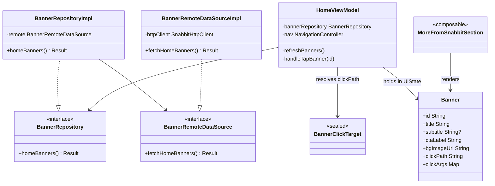
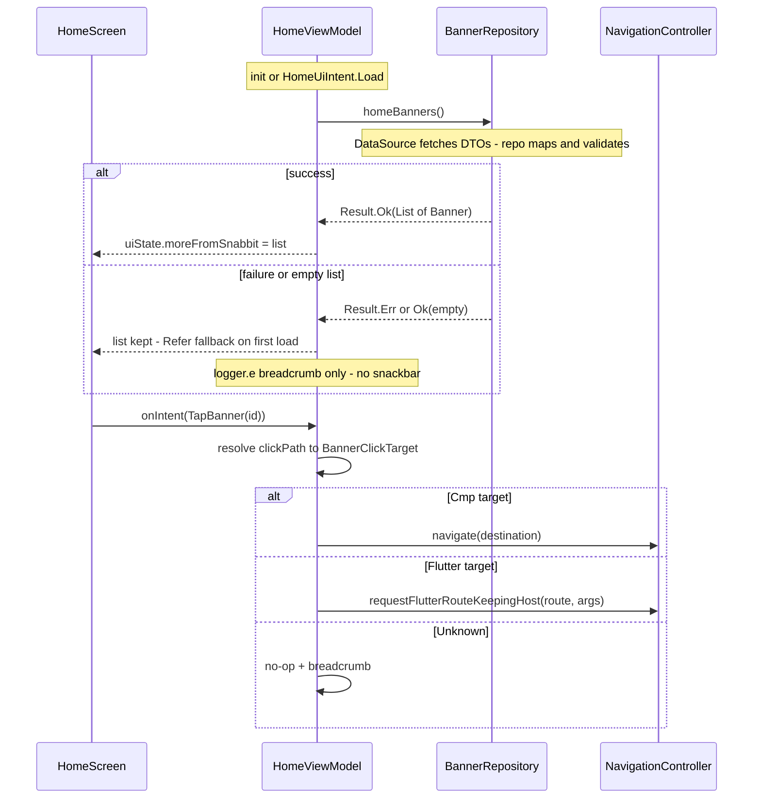

# LLD — Home Banners (BE-driven "More From Snabbit" list)

**Scope of this doc:** detailed HOW for ONE component in `:shared` — replace the hardcoded
`moreFromSnabbit` seed in `HomeViewModel` with a backend-fetched banner list, and make
`TapBanner` navigate. No system redesign. Crosscutting rules are **cited** from
`.claude/documents/*`, never restated.

> **Feature-first layout + build-feature GATE 4 order** (`cmp-architecture-structure.md`):
> Contract → DataSource → Strings → ViewModel → Screen → Fake → Test.

## 1. Introduction

- **Component purpose:** the recurring promo-banner list under "More From Snabbit" on the
  runner Home screen, currently a hardcoded single Refer banner
  (`HomeViewModel.initialState`, `home/presentation/HomeViewModel.kt`). This slice makes the
  list server-driven: contents, imagery, CTA copy/icon, and click destination all come from
  a **new BE HTTP endpoint** (decision: BE endpoint over Remote Config / widget envelope).
- **Implements:** extension of the existing `features/home/` feature — nested slice
  `features/home/banners/` (same nest rule as `home/suspended/`: meaningless without Home,
  rides Home's lifecycle).
- **Objectives:**
  1. Render N banners exactly as the BE orders them.
  2. **One banner → full available width. Multiple → auto-scrolling carousel** with the
     adjacent card peeking at the edge so the runner sees there's more (§7.2, §8.1).
  3. Tap → navigate to a **mixed** target: CMP `Destination` or Flutter route (decision).
  4. **The section never goes blank:** BE returning an empty list, malformed rows only, or
     erroring out → the client-side **Refer fallback banner** (today's hardcoded seed) renders
     instead (§8.3). Never an error UI.

**Explicitly out of scope:** the maestro-core endpoint itself (BE work, tracked separately);
impression/scroll analytics; banner scheduling windows (BE owns filtering — the app renders
whatever the endpoint returns).

## 2. Design Overview

| Aspect | Choice |
|---|---|
| Slice location | `features/home/banners/` — `data/{remote,repository}/` + `domain/repository/` (mirrors `home/suspended/` exactly) |
| Domain model | Grow the existing `home/domain/model/Banner.kt` (its KDoc already anticipates this) |
| Layers | Clean-arch full stack: `BannerRemoteDataSource` (transport, returns DTOs) → `BannerRepositoryImpl` (DTO→domain mapping, row validation) → `BannerRepository` (domain interface, what the VM injects) |
| Fetch trigger | `HomeViewModel.init` + `HomeUiIntent.Load` (pull-to-refresh) — same lifecycle as `refreshNearbySeva()` |
| State | `HomeUiState.moreFromSnabbit` (exists) — no new UiState field |
| Navigation | `NavigationController` injected into `HomeViewModel` per D2 (`core-facts.md`) — CMP targets via `navigate(Destination)`, Flutter targets via `requestFlutterRouteKeepingHost(...)` (same call shape as the Coins pill in `homeModule`) |
| Images | DS `SnabbitRemoteImage` atom (Coil3-backed) for BE image URLs; bundled `home_banner_refer_fallback.webp` compose resource for the offline fallback card |
| Caching | None. In-memory in UiState for the screen's lifetime. `[ASSUMPTION]` banner list is small (≤5) and a per-mount fetch is acceptable |

**No `banners/presentation/`.** MVI machinery follows behaviour, not files (`shared/CLAUDE.md`):
banners are not a behavioural unit — no own screen, lifecycle, or modal flow — so they get no
ViewModel/Contract of their own. Presentation is Home's: state on `HomeUiState.moreFromSnabbit`,
intent `HomeUiIntent.TapBanner`, UI in `home/presentation/ui/MoreFromSnabbitSection.kt`
(stateless, state hoisted to `HomeViewModel`). Same shape as `home/suspended/` — data/domain
slice + a card rendered by Home's presentation layer.

| Presentation file (exists — modified, not created) | Change |
|---|---|
| `home/presentation/HomeContract.kt` | none (field + intent already present) |
| `home/presentation/HomeViewModel.kt` | inject `BannerRepository` + `NavigationController`; `refreshBanners()`; `TapBanner` → resolver (§8); delete hardcoded seed |
| `home/presentation/ui/MoreFromSnabbitSection.kt` | `RemoteImage` bg layer, optional subtitle, data-driven CTA; single-vs-carousel layout + auto-scroll (§7.2, §8.1) |
| `home/domain/model/Banner.kt` | grow fields (§5) |

## 3. Public API / Contract

No new public API. The slice's surface is the existing `HomeContract`:

| Member | Params | Returns | Pre-conditions | Post-conditions |
|--------|--------|---------|----------------|-----------------|
| `HomeUiState.moreFromSnabbit` | — | `List<Banner>` | — | BE-ordered when fetch yields ≥1 valid banner; else the Refer fallback (§8.3) — never empty |
| `HomeUiIntent.TapBanner` (exists) | `id: String` | — | id ∈ current list, else no-op | nav fired per §8; `banner_clicked` tracked |
| `HomeUiIntent.Load` (exists) | — | — | — | banner refetch launched alongside seva/profile refresh |

### 3.1 BE endpoint contract

`[TBD — confirm with BE]` Proposed, mirroring `SuspendedRemoteDataSource`'s conventions
(relative path on `awaitNetworkConfig().baseUrl`, auth via interceptor chain):

```
GET api/v1/runners/me/home_banners
200 → { "banners": [ BannerDto, ... ] }
```

Example response — first entry is the Refer banner as BE should serve it (the client-side
fallback in §8.3 mirrors this same shape), second shows a webview-target banner:

```json
{
  "banners": [
    {
      "id": "refer_v1",
      "title": "Refer and earn upto",
      "subtitle": "₹4000",
      "button_text": "Refer Now",
      "button_icon": null,
      "banner_bg_image": "https://cdn.snabbit.com/expert/banners/refer_bg.png",
      "button_click_path": "/referral-home",
      "click_args": {}
    },
    {
      "id": "gold_coins_promo",
      "title": "Your coins are waiting",
      "subtitle": "Redeem now",
      "button_text": "View Rewards",
      "button_icon": "https://cdn.snabbit.com/expert/banners/icons/coin.png",
      "banner_bg_image": "https://cdn.snabbit.com/expert/banners/coins_bg.png",
      "button_click_path": "/app-web-view",
      "click_args": {
        "webviewPath": "v1/payouts/rewards?type=gold_coins",
        "title": "Gold coins"
      }
    }
  ]
}
```

(`/referral-home` and `/app-web-view` are real Dart `routeName`s — `referral_home.dart`,
`main.dart` routes map. CDN URLs illustrative.)

`[ASSUMPTION]` snake_case wire names, per existing runner endpoints:

| Wire key | Type | Required | Maps to |
|---|---|---|---|
| `id` | string | yes | `Banner.id` (analytics + tap lookup) |
| `title` | string | yes | `Banner.title` |
| `subtitle` | string | no | `Banner.subtitle` (the big "₹4000" line today) |
| `button_text` | string | yes | `Banner.ctaLabel` |
| `button_icon` | string (URL) | no | `Banner.ctaIconUrl` — rendered in the CTA's `SnabbitButton.leadingIcon` slot (16dp `SnabbitRemoteImage`) |
| `banner_bg_image` | string (URL) | yes | `Banner.bgImageUrl` |
| `button_click_path` | string | yes | `Banner.clickPath` (see §8 resolver) |
| `click_args` | map<string,string> | no | `Banner.clickArgs` (webview path, page args) |

Server-driven copy note: `title`/`button_text` arrive pre-localised from BE
(server-driven i18n, forward standard per `cmp-architecture-structure.md`) — no
composeResources entries for banner copy.

## 4. Internal Interfaces & Data

### 4.1 Collaborator contracts (seams — `suspend`, main-safe)

| Component | Method | Params | Returns |
|-----------|--------|--------|---------|
| `BannerRepository` (new, `domain/repository/`) | `homeBanners()` | — | `Result<List<Banner>, NetworkError>` |
| `BannerRepositoryImpl` (new, `data/repository/`) | `homeBanners()` | — | maps DTOs → domain |
| `BannerRemoteDataSource` (new, `internal`, `data/remote/`) | `fetchHomeBanners()` | — | `Result<List<BannerDto>, NetworkError>` |
| `SnabbitHttpClient` (exists) | `execute` | `SnabbitRequest` | `Result<SnabbitResponse, NetworkError>` |
| `NavigationController` (exists) | `navigate` / `requestFlutterRouteKeepingHost` | per §8 | — |
| `AnalyticsTracker` (exists) | `track` | `"home_banner_clicked"`, `{banner_id, click_path}` | — |

Responsibility split (same as `suspended/`): the DataSource is transport-only — request,
deserialize, hand back raw DTOs. The **repository** owns the domain decisions: DTO → `Banner`
mapping and row validation (blank `id`/`bgImageUrl`/`clickPath` → skip that banner, keep the
rest — mirrors Flutter `BannerPlacement.fromJson`'s skip-unparseable behaviour). The VM depends
only on the `domain/repository/BannerRepository` interface (dependencies point inward, per
`shared/CLAUDE.md` layering).

### 4.2 Local data store / schema

N/A — no persistence. List lives in `HomeUiState` only.

## 5. Data Structures

> `UiState` unchanged; errors stay `NetworkError` internally (banners never surface an error
> to UI — see §10).

| Type | Fields / values |
|-------------|-----------------|
| `Banner` (grown, `home/domain/model/`) | `id: String`, `title: String`, `subtitle: String?`, `ctaLabel: String`, `bgImageUrl: String`, `clickPath: String`, `clickArgs: Map<String, String> = emptyMap()` |
| `BannerDto` (new, `@Serializable`, `banners/data/remote/dto/`) | nullable mirror of §3.1 wire keys |
| `BannerClickTarget` (new, sealed, resolver output) | `Cmp(destination: Destination)` · `Flutter(route: String, args: Map<String, String>)` · `Unknown` |

## 6. Per-Platform Mapping

No new `expect/actual` seams — the slice is pure `commonMain` over existing platform seams:

| Seam / capability | Android (androidMain) | iOS (iosMain) |
|-------------------|-----------------------|---------------|
| HTTP | existing `SnabbitHttpClient` engine | same (Ktor) |
| Image loading | Coil3 via `RemoteImage` (loader installed by `KmpBootstrap`) | same seam; `[TBD]` iOS loader bootstrap parity |
| Flutter route hop | `NavigationController` host bridge | N/A on iOS until the Flutter host exists — `Flutter` targets no-op + breadcrumb `[ASSUMPTION]` |

Gate: `./gradlew :shared:compileTestKotlinIosArm64` (per `library-guide.md`).

## 7. Structural Design

### 7.1 Class / type diagram



### 7.2 Class descriptions

**`BannerRemoteDataSourceImpl`** — responsibility: one GET + deserialization, returns raw DTOs.
Pattern copy of `SuspendedRemoteDataSourceImpl`.

**`BannerRepositoryImpl`** — responsibility: DTO → `Banner` mapping + malformed-row skipping;
passes `NetworkError` through untouched. Pattern copy of `SuspendedRepositoryImpl`. Both
bindings registered in a `bannerModule` (`banners/di/`, mirrors `suspendedModule`):
`single<BannerRemoteDataSource>` + `single<BannerRepository>`.

**`HomeViewModel` (modified)** — new constructor params `bannerRepository: BannerRepository`
(required) and
`nav: NavigationController?` (nullable, previews/tests stay DI-free — same pattern as
`sosCoordinator`). New private `refreshBanners()`; `TapBanner` branch goes from `Unit` to
`handleTapBanner(id)`. The hardcoded seed in `initialState` is **promoted, not deleted**: it
becomes the `REFER_FALLBACK` companion constant (§8.3) — `initialState` seeds it, and a fetch
only replaces it when it yields ≥1 valid banner.

**`MoreFromSnabbitSection` / `BannerRow` (modified)** — `BannerRow` gains a `RemoteImage`
background layer under the existing copy/CTA (its `bgNeutralStrong` placeholder stays visible
until the image loads — `RemoteImage` degrades by drawing nothing, per its KDoc). CTA icon:
`[TBD]` — `SnabbitButton` has no async-icon slot today (DS gap; see the recorded
`project_home_cmp_ds_gaps` list). Ship text-only CTA first; icon lands when DS supports it or
via a `RemoteImage` inside a row next to the label.

**Layout — single vs carousel.** Pattern copy of the shipped
`profile/ui/ProfileNudgeCarousel.kt`, which solves exactly this shape:

| List size | Rendering |
|---|---|
| 1 | one full-width `BannerRow` — no pager, no dots |
| ≥2 | **circular `HorizontalPager`** — `contentPadding` end-peek shows the adjacent card's leading edge (the "there's more" affordance); huge virtual page count mapped back via `% pageCount` so swiping wraps both ways and the peek is always filled; dot indicators below (same size, active differs by colour) |

Plus the one thing `ProfileNudgeCarousel` doesn't have: **auto-scroll** (§8.1). All pager
machinery is `androidx.compose.foundation.pager` — `commonMain`/iOS-safe, already proven in
profile. Peek/spacing dims reuse `SnabbitTheme.spacing` tokens; exact peek width `[TBD]` from
Figma (profile uses its `ProfileTileDefaults.NudgePeek`).

## 8. Algorithms & Logic

### 8.1 Carousel auto-scroll

UI-only concern — lives in `MoreFromSnabbitSection` as a `LaunchedEffect`, **not** in the VM
(purely visual, no domain state; the VM never knows which page is showing):

```
LaunchedEffect(pageCount) {
    while (true) {
        delay(AUTO_SCROLL_INTERVAL)                      // 4s [ASSUMPTION — confirm with design]
        if (!pagerState.isScrollInProgress) {            // never fight the user's finger
            pagerState.animateScrollToPage(pagerState.currentPage + 1)
        }
    }
}
```

Rules:
- Only mounted when `pageCount ≥ 2` (single banner has no pager).
- Advancing is always `+1` on the **virtual** index — the circular mapping (§7.2) wraps
  last → first with a normal forward animation, no jump-back scroll.
- A user drag takes priority: the tick is skipped while `isScrollInProgress`; the next tick
  resumes from wherever the user left the pager. `[ASSUMPTION]` no
  pause-after-interaction grace period — add one only if design asks.
- `LaunchedEffect` cancels with composition — no leak when Home leaves the screen
  (`core-facts.md` lifecycle rules; `delay` is cancellation-cooperative).

### 8.2 Click-path resolver

**(mixed CMP + Flutter — decision).** Explicit prefix discriminator,
agreed as part of the BE contract:

| `clickPath` shape | Target | Action |
|---|---|---|
| `decider:<key>` | client-resolved | resolved AT TAP TIME through `ProfileRouteDecider` with live RC/profile state — for destinations that depend on runner state that can flip after the banner fetch. Keys: `refer` (referrals-v2 RC → webview vs native ReferralsHome), `earnings` (rate-card v2 from `runners/me` → monthly-summary webview vs PayoutHome) |
| `cmp:<destinationKey>` | reserved | on the wire contract but **unimplemented** (G1) — falls through to the unknown-path breadcrumb until the first CMP banner destination exists; reintroduce the registry then |
| `/some-flutter-route` (leading `/`) | `Flutter` | `nav.requestFlutterRouteKeepingHost(route, args = clickArgs, recreateKey = "bottom_nav_shell", recreateArgs = {initialTab: Home})` — exact shape of the Coins pill hop in `homeModule` |
| anything else / unknown `cmp:`/`decider:` key | `Unknown` | no-op + `logger.e` breadcrumb (old app version receiving a newer path must not crash — forward compatibility) |

**BE path allowlist** (verified against `appRoutes` in `lib/main.dart`): native pages —
`/referral-home`, `/payout-home`, `/transaction-history`, `/early-payouts`, `/bonus-home`,
`/net-earnings`, `/daily-earnings-list`, `/incentive-details`, `/overtime-details`, `/tips-info`,
`/performance`, `/attendance`, `/insurance-support`, `/long-leave`, `/festive-bonus`;
dynamic — `decider:refer`, `decider:earnings`; webview — `/app-web-view` with
`click_args: {webviewPath|url, title}`. Onboarding/signup routes deliberately excluded.

Edge cases: blank path → `Unknown`; banner id not in current list (stale tap during refresh) → no-op.

### 8.3 Refer fallback banner

The section must never go blank — parity with today's shipped behaviour (one hardcoded Refer
banner). One constant in `HomeViewModel.companion`:

```
REFER_FALLBACK = Banner(
    id = "refer_fallback",
    title = "Refer and earn upto",       // [ASSUMPTION] copy frozen at today's seed values
    subtitle = "₹4000",
    ctaLabel = "Refer Now",
    bgImageUrl = "",                     // blank → RemoteImage draws nothing → bgNeutralStrong placeholder (today's look)
    clickPath = "/referral-home",        // Dart ReferralHome.routeName — tap now actually navigates (today it no-ops)
)
```

Rules:
- `initialState` seeds `moreFromSnabbit = listOf(REFER_FALLBACK)` — visible immediately, no
  banner shimmer.
- `refreshBanners()` replaces the list **only** when the fetch returns `Result.Ok` with ≥1
  valid banner. `Ok(empty)` and `Err` both keep whatever is currently shown (fallback on first
  load; the last good list on a later pull-to-refresh failure).
- The fallback is client-side only — it never goes through the repository/DTO path, so §4.1
  row-validation (which requires a non-blank `bgImageUrl`) doesn't apply to it.
- Net effect vs today: strictly better — same banner, but the tap works.

## 9. Dynamic Model (Sequences / State)



## 10. Error Handling

Home uses `NetworkError` / `Result` from `core/network` + `core/result` (this feature's
established error currency — not the wire-level `AppErrorType` enum, which `SnabbitHttpClient`
already handles underneath). Banners are decorative, so the policy is the `refreshNearbySeva()`
one: silent degrade + breadcrumb; rethrow `CancellationException` first (`core-facts.md`).

| Failure | Internal type | Effect to UiState | Retryable |
|---------|--------------|-------------------|-----------|
| HTTP / transport error | `NetworkError` | list unchanged — Refer fallback if never loaded, last good list otherwise (§8.3) | yes — next `Load` |
| BE returns `Ok` with empty list | — | same as transport error: current list kept (§8.3) | yes |
| Malformed banner row | mapping skip | row dropped, rest render; **all** rows malformed → treated as empty (§8.3) | n/a |
| Whole-body parse failure | `NetworkError`-equivalent Err | as transport error | yes |
| Unknown `clickPath` | `BannerClickTarget.Unknown` | none (tap no-ops) | n/a |
| Image URL 404 | Coil load failure | placeholder bg stays (RemoteImage draws nothing) | Coil retries per its policy |

## 11. Concurrency & Lifecycle

Per `core-facts.md` (D1): all work on `viewModelScope`; no injected scopes; `AppDispatchers`
not needed — `SnabbitHttpClient` is main-safe like every existing DataSource call in this VM.
`refreshBanners()` is fire-and-forget like `refreshNearbySeva()`; a `Load` while a fetch is
in flight simply launches again and last-write-wins on the StateFlow (banner list is
idempotent — no single-flight guard needed). Navigation is one-shot via the injected
`NavigationController` (D2) — **no** new `HomeUiEffect` variant.

## 12. Unit Test Plan

> Fakes over mocks; `commonTest`. Verify:
> `./gradlew :shared:testDebugUnitTest :shared:compileTestKotlinIosArm64`.

| Behaviour | Test | Fake(s) |
|-----------|------|---------|
| fetch success → `moreFromSnabbit` populated, BE order kept | `homeBanners loads from repository` | `FakeBannerRepository` |
| fetch failure → Refer fallback stays, no crash, no snackbar effect | `homeBanners failure keeps refer fallback` | fake returning `Result.Err` |
| fetch `Ok(empty)` → Refer fallback stays | `empty response keeps refer fallback` | fake returning `Result.Ok(emptyList())` |
| fallback tap → Flutter route `/referral-home` | resolver test on `REFER_FALLBACK` | `FakeNavigationController` |
| malformed row skipped, valid rows kept | `BannerRepositoryImpl` mapping test (real repo + `FakeBannerRemoteDataSource`) | `FakeBannerRemoteDataSource` |
| DataSource request shape + deserialization | `BannerRemoteDataSourceImpl` test | fake `SnabbitHttpClient` |
| `Load` intent refetches | `load intent refreshes banners` | fake with call counter |
| `TapBanner` → `cmp:` path → `nav.navigate` | resolver test | `FakeNavigationController` (exists in nav tests) |
| `TapBanner` → `/route` path → `requestFlutterRouteKeepingHost` with clickArgs | resolver test | same |
| `TapBanner` → unknown path / stale id → no nav call | resolver edge test | same |
| `TapBanner` tracks `home_banner_clicked` | analytics test | `FakeAnalyticsTracker` (exists) |
| 1 banner → full-width, no pager/dots; ≥2 → pager + dots | compose UI test on `MoreFromSnabbitSection` (deterministic images via `FakeImageLoaderEngine`, per `RemoteImage` KDoc) | — |

## 13. Traceability

| Requirement | LLD section | Planned tests |
|-------|-------|---------------|
| BE-driven list | §3.1, §4.1 | fetch success/failure |
| title / buttonText / bannerBgImage / buttonIcon | §5, §7.2 | mapping test |
| buttonClickPath mixed nav | §8.2 | resolver tests |
| single full-width vs auto-scrolling peek carousel | §7.2, §8.1 | compose UI test |
| Refer fallback on empty/error | §8.3, §10 | fallback tests |

## 14. Open Questions

| # | Question | Owner | Needed by |
|---|----------|-------|-----------|
| 1 | Endpoint path + exact wire keys (§3.1 is a proposal) | BE | before DataSource impl |
| 2 | `clickPath` discriminator: is BE happy with `cmp:` prefix vs leading `/`? Alternative: explicit `target_type` field | BE + app | with #1 |
| 3 | CTA icon: BE sends URL — DS `SnabbitButton` has no icon slot. Ship text-only first? | Design/DS | before UI polish |
| 4 | Does BE own time-window/placement filtering (Flutter RC banners filtered client-side via `isActiveNow`)? Assumed yes | BE | with #1 |
| 5 | Analytics event name — `home_banner_clicked` assumed; confirm against Flutter tracking events | Analytics | before merge |
| 6 | Auto-scroll interval (4s assumed) + peek width — confirm with design/Figma | Design | before UI polish |
